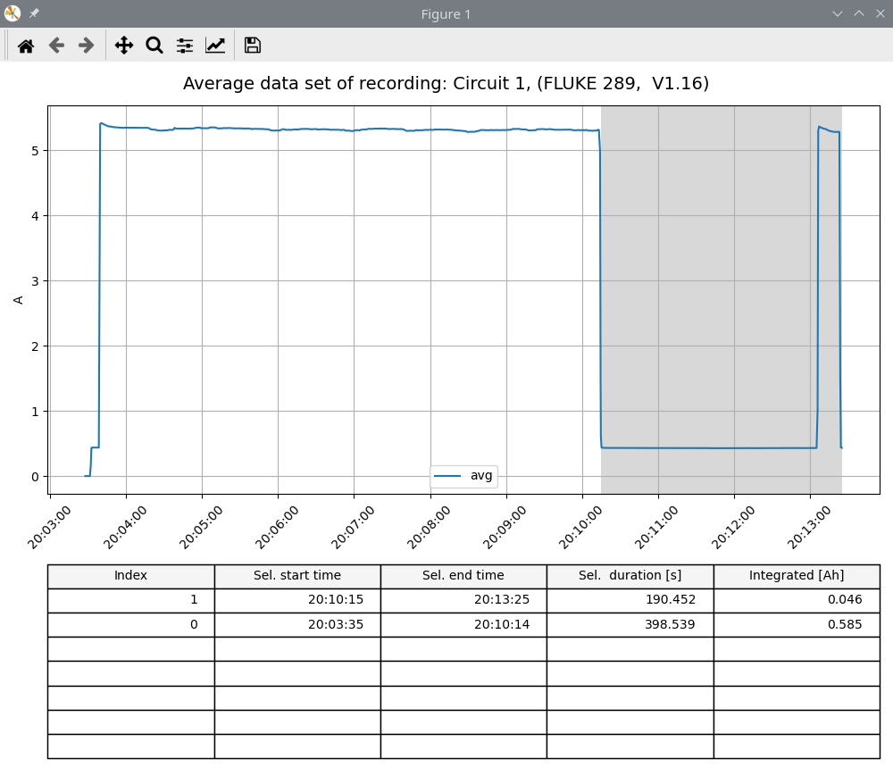

# fluke_recordings
A python scrip to deal with fluke recordings. Implements functions like plotting, integration...


```
usage: fluke_tool.py [-h] (-p | -i st[s] sp[s] | -gi) [-d] [-m MULTIPLY] [-r] file

Data visualization tool for Fluke 287/289 recordings

positional arguments:
  file                  Filename of a FlukeView forms *.csv export file

optional arguments:
  -h, --help            show this help message and exit
  -p, --print           Plot data of recording
  -i st[s] sp[s], --integrate st[s] sp[s]
                        Integrate over a specified time duration in seconds (average dataset)
  -gi, --guiint         Integrate over a mouse selected time duration (average dataset)
  -d, --download        Download data from Fluke 287
  -m MULTIPLY, --multiply MULTIPLY
                        Paramter to specify a constant multiplier
  -r, --relative_t      Make time vectors relative (start from t=0)
  ```

### Graphical selection of integration boundaries
Excecute pyton script from command line
```
python fluke_tool.py fluke_export_cir_1.csv -gi
```
Select boundaries by unsing the matplotlib SpanSelector widget (click on plot).

[]

### Requirements
 - scipy
 - matplotlib

### TODO
- Take proper care of units
- implement download and list function from fluke multimeter
- export the downloaded data to FlukeView Forms compatible *.csv file


